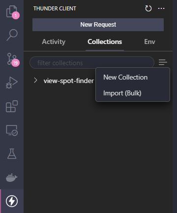
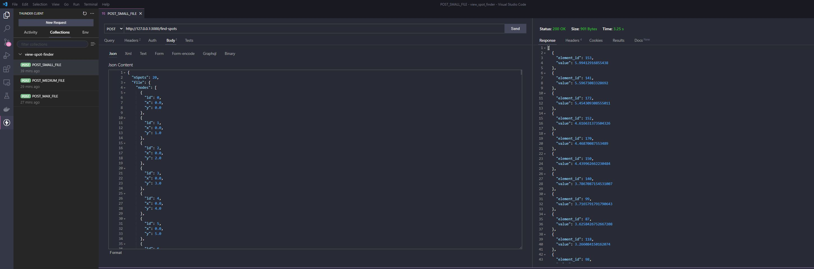

# view_spot_finder
 
This repository provides two solutions (local executable and aws serverless function via sam) for the view spot finder coding challenge see the `Assignment[1][1][1][1][2].pdf`. 


## view_spot_finder_local

Here we have the local implementation of the coding challenge. To run it locally install go https://go.dev/learn/.
Navigate to the folder `./view_spot_finder_local` and execute the following:

```bash
go run .\main.go ..\mesh[1][1][1][1].json 20
```

* The first parameter needs to point to json file (like in the root folder of the project \mesh[1][1][1][1].json...)
* The second parameter specifies how many view spots should be output

There are also executables provided under `Release v1.0` on the release page in github. Download the executable for your specific system.
Here's an example for windows:
```bash
./view_spot_finder_local_win.exe C:\Development\git_repository\view_spot_finder\mesh_x_sin_cos_20000[1][1][1][1].json 20
```

## view_spot_finder_sam

Here we have the same coding challenge implementation, but developed as an AWS Serverless Function. To get started get the AWS SAM CLI https://docs.aws.amazon.com/serverless-application-model/latest/developerguide/serverless-sam-cli-install.html. (You also need docker)

To test the function, I provided several HTML-Requests as templates. These are located under `./view_spot_finder_sam/thunder-requests`. To use them install the Thunder Client extension for Visual Studio Code. https://marketplace.visualstudio.com/items?itemName=rangav.vscode-thunder-client

After that you can import the collection of requests via Collections -> Import (Bulk) and select the `thunder-collection_view-spot-finder.json`.



To start the local api, execute the following (clearly in the `view_spot_finder_sam` folder)
```bash
sam local start-api
```

After the server started you can execute th requests with the Thunder Client. 


If you want to test the application after changes, you need to execute `make` (you need to have make installed on your system) under the `./view_spot_finder_sam/` folder. It will build the new version for the AWS Serverless Function.
